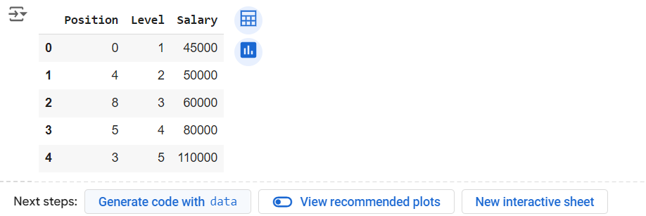

# Implementation-of-Decision-Tree-Regressor-Model-for-Predicting-the-Salary-of-the-Employee

## AIM:
To write a program to implement the Decision Tree Regressor Model for Predicting the Salary of the Employee.

## Equipments Required:
1. Hardware – PCs
2. Anaconda – Python 3.7 Installation / Jupyter notebook

## Algorithm
1. Load dataset and split into features (X) and target (y).
2. Train a Decision Tree Regressor on X and y.
3. Predict salary values using the trained model.
4. Evaluate model performance using MSE and R² metrics.
5. Plot and visualize the decision tree structure.

## Program and Output:
```
/*
Program to implement the Decision Tree Regressor Model for Predicting the Salary of the Employee.
Developed by: JAYASREE R
RegisterNumber: 212223230087 
*/
```
```
import pandas as pd
data=pd.read_csv("Salary.csv")
data.head()
```

```
data.info()
```

```
from sklearn.preprocessing import LabelEncoder
le=LabelEncoder()
data["Position"]=le.fit_transform(data["Position"])
data.head()
```

```
x=data[["Position","Level"]]
y=data["Salary"]
```
```
from sklearn.model_selection import train_test_split
x_train,x_test,y_train,y_test=train_test_split(x,y,test_size=0.2,random_state=2)
from sklearn.tree import DecisionTreeRegressor
dt=DecisionTreeRegressor()
dt.fit(x_train,y_train)
y_pred=dt.predict(x_test)
```
```
from sklearn import metrics
mse=metrics.mean_squared_error(y_test,y_pred)
print(mse)
```


```
r2=metrics.r2_score(y_test,y_pred)
print(r2)
dt.predict([[5,6]])
```


## Output:


## Result:
Thus the program to implement the Decision Tree Regressor Model for Predicting the Salary of the Employee is written and verified using python programming.
